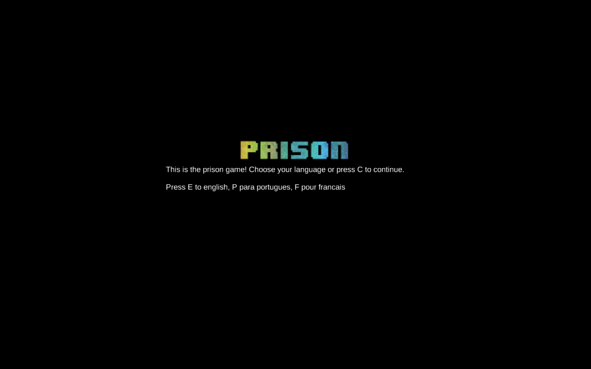
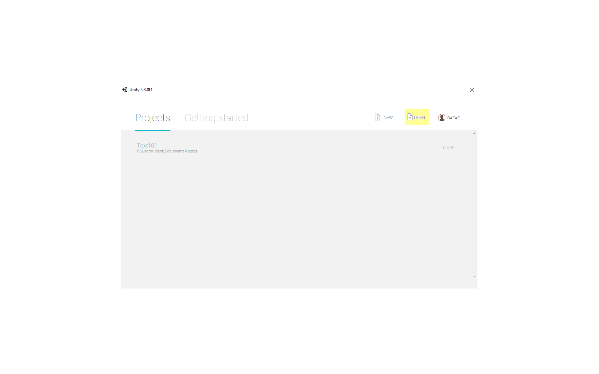

# Prison Multilingual
> A copy of the classical Text101, with multilingual capacity. 

Created using [Unity](https://unity3d.com)

Never forget the classics! In this version of Text101 players are able to play in various different languages. As long as there is anyone knowing a new
language, the game will be able to be translated and be playable all aroud the world. 

The player is traped in a prison and needs to escape. The story is still in development, and will increase gradually. Try to scape this prison yourself
and prove you're the best! You're certainly going to have fun.

## Installation

The installation of this project is a straight forward one. Simply install Unity3D

Open Unity3D and then click on open, and choose the folder where the repository was downloaded

From there you are able to build a playable version or make any changes you might consider as proper.

## Usage example

The game have a simple Scene and one Script. As the game will increase, some more scenes will appear, as well as more
scripts to hold things together in a maintainable way. Feels free to suggest, create and increase things. 

## Release History

* 2.0
  * This is the first release of the game. It contains only the first scene of the game, the Prison itself. In next releases, for every new scene
    a new version will be in place. So in version 3, we will have 2 scenes on the game while the scene 3 is being created. Every new part designed
	will count as a sub-version. To explain in a practical way:
    * Version 2.0 Have only one complete scene with all it's parts complete.
	* Version 2.1 Will have 2 scenes, and one part of scene 2 complete. 
	* Version 2.X Will have 2 scenes, and X parts complete
	* Version 3.0 will have all scene 2 complete
    * Any minor release will be an enhance on the game motor, like creating random questions, etc. In this case it wold be, for example, version 2.1.X			

## Meta

Rafael Costa 
* [@rafaelcostatech](https://twitter.com/@rafaelcostatech)
* rafael@rafaelcostatech.com
* http://rafaelcostatech.com/

## Contributing
	The contribution manual is in development and shall be here soon

1. Fork it (https://github.com/rafaelcostatech/Text101-Multilingual)
2. Create your feature branch (`git checkout -b feature/fooBar`)
3. Commit your changes (`git commit -am 'Add some fooBar'`)
4. Push to the branch (`git push origin feature/fooBar`)
5. Create a new Pull Request

